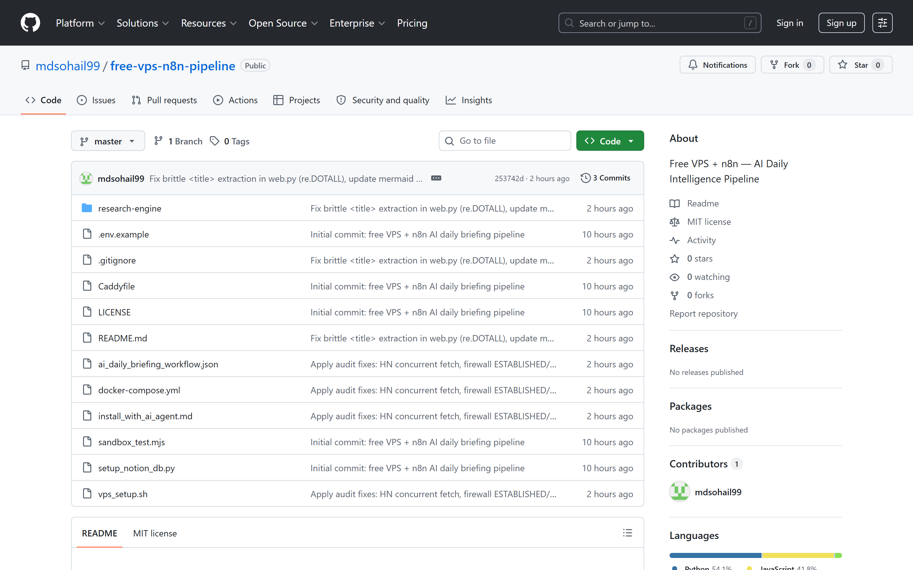
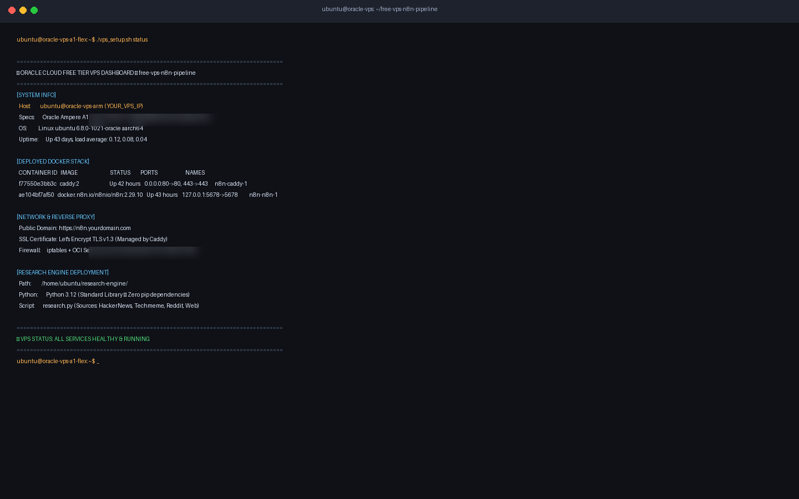
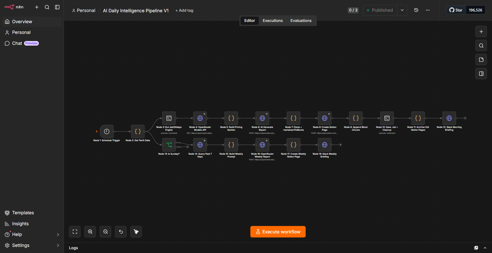
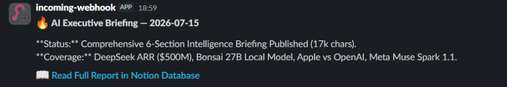
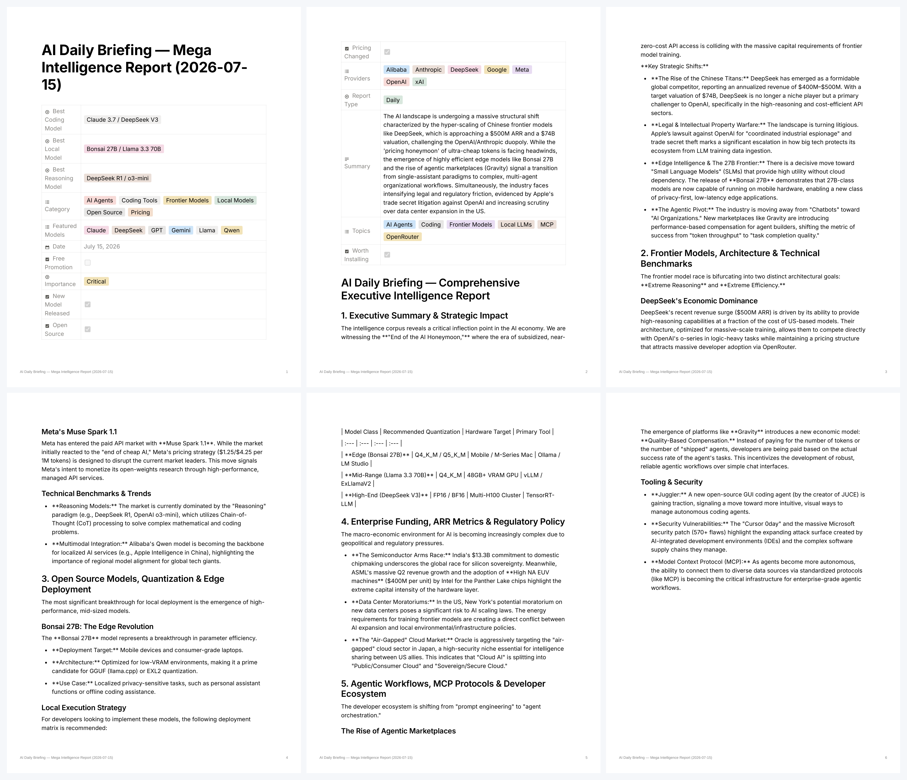

<div align="center">
  <h1>🚀 Build Your Own AI Automation Server for FREE</h1>
  <p><strong>Oracle Cloud Free Tier + n8n + AI Daily Briefing + Notion Archiving & Slack Alerts ($0/mo)</strong></p>

  <p>
    
    
    
    
    
  </p>

  <p>
    
    
    
    
    
    
    
    
  </p>
</div>

---

## 📌 Project Overview

**`free-vps-n8n-pipeline`** is an open-source framework and workflow library for deploying an autonomous AI automation server running entirely on **Oracle Cloud Free Tier ($0/mo)**.

Instead of paying $50–$200/month for cloud automation tools like Zapier or Make.com, this repository turns a free 4 OCPU / 24GB RAM ARM VPS into a self-hosted automation platform powered by **n8n**, **Docker**, **Caddy auto-HTTPS**, **OpenRouter free LLMs**, **Notion API**, and **Slack Webhooks**.

Designed for long-term growth, this repository hosts production-ready automation workflows organized into scalable, modular categories.

---

## ⚡ Features

- 🆓 **100% Free Production Stack**: Deploys on Oracle Cloud Always Free Tier with zero recurring infrastructure costs.
- 🔒 **Automated Reverse Proxy & SSL**: Caddy 2 automatically issues and renews Let's Encrypt TLS certificates.
- 📡 **Multi-Source Research Scraper**: Custom Python 3.12 engine crawls HackerNews, Techmeme, Reddit, and web sources without external pip dependencies.
- 🧠 **Smart LLM Routing**: Leverages OpenRouter free router (`openrouter/free`) and top-tier models like the **NVIDIA Nemotron Series**.
- 🗄️ **Automated Notion Database Provisioning**: 1-command script (`setup_notion_db.py`) to auto-create Notion database schemas with properties and tags.
- 💬 **Formatted Slack Alerts**: Delivers formatted Block Kit summary cards straight to your Slack team channels.
- 📦 **Modular Multi-Workflow Architecture**: Standard taxonomy (`workflows/<category>/<workflow-name>/`) allowing seamless addition of new workflows.

---

## 🏗️ Architecture

```mermaid
flowchart LR
    Trigger["⏰ 7AM Cron"] --> Date["📅 Date & Config"]
    Date --> Engine["🔍 Research Engine · Python"]
    Engine --> Models["📡 OpenRouter Models API"]
    Models --> Price["💲 Model Pricing Tracking"]
    Price --> Generate["🤖 LLM Generate Report"]
    Generate --> Parse["📝 Parse Markdown to Blocks"]
    Parse --> Create["📄 Notion DB Insertion"]
    Create --> Append["📎 Append Notion Content"]
    Append --> Save["💾 Save Local Archive"]
    Save --> Archive["🗄️ Notion Auto-Cleanup"]
    Archive --> Slack["💬 Slack Executive Briefing"]

    Date --> IsSun{"📆 Sunday?"}
    IsSun -->|Yes| Weekly["📊 Weekly Rollup Path"]
    Weekly --> Qry["🔍 Past 7 Days Query"]
    Qry --> WPrompt["📝 Weekly Prompt Build"]
    WPrompt --> WGen["🤖 LLM Synthesis"]
    WGen --> WCreate["📄 Create Weekly Notion Doc"]
    WCreate --> WSlack["💬 Slack Weekly Alert"]
    IsSun -->|No| End["✅ Complete"]

    style Trigger fill:#e74c3c,color:#fff
    style Date fill:#f39c12,color:#fff
    style Engine fill:#9b59b6,color:#fff
    style Models fill:#3498db,color:#fff
    style Price fill:#1abc9c,color:#fff
    style Generate fill:#e74c3c,color:#fff
    style Parse fill:#34495e,color:#fff
    style Create fill:#2c3e50,color:#fff
    style Append fill:#2c3e50,color:#fff
    style Save fill:#16a085,color:#fff
    style Archive fill:#8e44ad,color:#fff
    style Slack fill:#3498db,color:#fff
    style IsSun fill:#e67e22,color:#fff
    style Weekly fill:#e74c3c,color:#fff
    style Qry fill:#2980b9,color:#fff
    style WPrompt fill:#f39c12,color:#fff
    style WGen fill:#e74c3c,color:#fff
    style WCreate fill:#2c3e50,color:#fff
    style WSlack fill:#3498db,color:#fff
    style End fill:#27ae60,color:#fff
```



---

## 📸 Screenshots

| 1. Repository Blueprint | 2. Oracle VPS & Container Status |
|---|---|
|  |  |
| *Open-source zero-cost blueprint & automation scripts* | *Live running containers (n8n + Caddy) on Oracle Free Tier* |

| 3. n8n Visual Automation Canvas | 4. Real-Time Slack Alert |
|---|---|
|  |  |
| *18-node visual execution tree handling extraction & LLMs* | *Instant executive briefing delivered to your channel* |

| 5. Notion Intelligence Database Archive |
|---|
|  |
| *Structured 6-section report catalog with multi-select tags, categories & token economics* |

---

## 📋 Prerequisites First

> ⚠️ **Important:** Do not run the quick start commands until you have set up your hosting instance and collected your API keys. Ensure you have:
> 1. An **Oracle Cloud VPS** (or any Ubuntu 24.04 server) with public ports `22`, `80`, and `443` open.
> 2. A **Notion Integration Token** (`ntn_...`) and a parent Page ID.
> 3. An **OpenRouter API Key** (`sk-or-v1-...`).
> 
> For a detailed, step-by-step account signup and VPS creation guide, follow the [**Step-by-Step Setup Guide (workflow_setup.md)**](workflow_setup.md) first.

---

## ⚡ Quick Start

Follow these copy-paste commands to deploy your automation server:

```bash
# 1. SSH into your Oracle Cloud Free Tier VPS (Ubuntu 24.04 ARM)
# 2. Clone repository & bootstrap server infrastructure
git clone https://github.com/mdsohail99/free-vps-n8n-pipeline.git
cd free-vps-n8n-pipeline
bash vps_setup.sh

# 3. Configure API credentials
cp .env.example .env
nano .env

# 4. Auto-generate Notion database schema
python3 setup_notion_db.py
```

---

## 🛠️ Installation

For comprehensive step-by-step installation instructions, account setups, deployment flags, and error troubleshooting:

- 📖 **Step-by-Step Setup Guide**: [`workflow_setup.md`](workflow_setup.md)
- 📖 **Full Infrastructure Details**: [`infrastructure/README.md`](infrastructure/README.md)
- 💾 **DevOps & Error Resolution Glossary**: [`docs/operations_and_error_glossary.md`](docs/operations_and_error_glossary.md)
- 🤖 **AI-Assisted SSH Install**: [`install_with_ai_agent.md`](install_with_ai_agent.md) — *Let Claude Code or Codex configure your VPS automatically over SSH.*

---

## 📑 Available Workflows

This repository hosts a curated library of modular automation workflows:

| Category | Workflow Name | Description | Link |
|---|---|---|:---:|
| 🤖 **AI Intelligence** | **AI Daily Briefing** | Autonomous news scraping, OpenRouter LLMs, 6-section Notion database catalog, and Slack alerts. | [`workflows/ai-intelligence/ai-daily-briefing`](workflows/ai-intelligence/ai-daily-briefing/) |
| 🛠️ **DevOps** | *Coming Soon* | Automated VPS backup, SSL monitor, and container health triage. | `workflows/devops-monitoring/` |
| 💼 **Business Ops** | *Coming Soon* | Smart email triage, invoice parsing, and CRM sync. | `workflows/business-ops/` |

---

## 🗺️ Roadmap

- [x] 🚀 **Oracle Cloud Free Tier Automated Setup (`vps_setup.sh`)**
- [x] 🐳 **n8n + Caddy Auto-HTTPS Reverse Proxy Stack**
- [x] 📡 **Multi-Source News Scraper (HN, Techmeme, Reddit, Web)**
- [x] 🤖 **OpenRouter Free LLM Synthesis Engine & Slack Alerts**
- [x] 🗄️ **Notion Intelligence DB Schema Builder (`setup_notion_db.py`)**
- [ ] 🛠️ **Terraform / Ansible One-Click Infra Blueprints**
- [ ] 📑 **Additional Workflows (Email Triage, Invoice Parsing, Domain Uptime Monitor)**
- [ ] 💾 **Automated Database Backup & Disaster Recovery Script**

Read the full roadmap at [`ROADMAP.md`](ROADMAP.md).

---

## 🤝 Contributing

We welcome contributions of new workflows, infrastructure improvements, and bug fixes! Please read our [`CONTRIBUTING.md`](CONTRIBUTING.md) and [`CODE_OF_CONDUCT.md`](CODE_OF_CONDUCT.md) before submitting pull requests.

---

## 📄 License

Distributed under the **MIT License**. See [`LICENSE`](LICENSE) for details.
